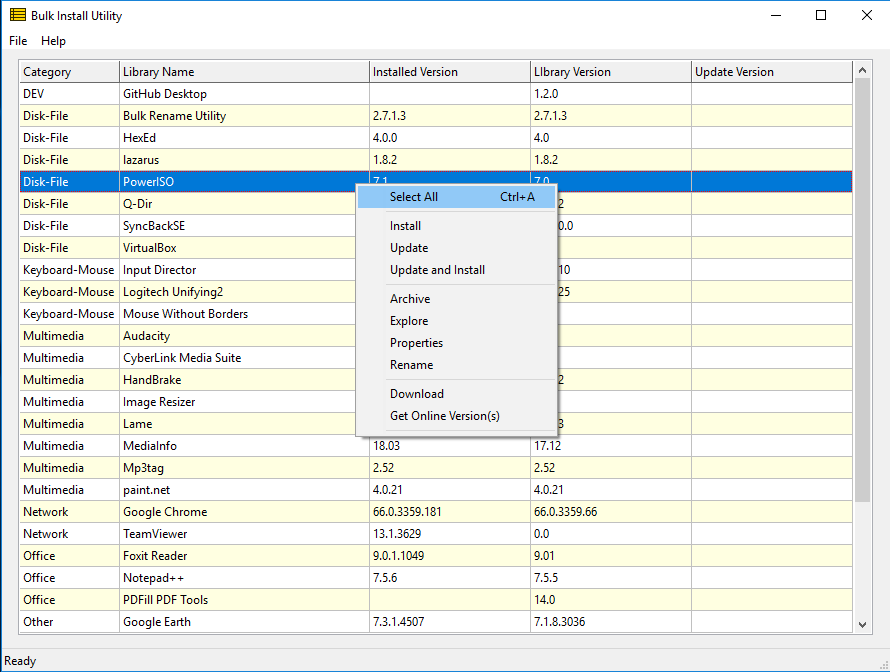

# Bulk Install Utility

Bulk software installation manager for Windows

## Table of Contents
Click to jump to that section, press Home to return to the top:
* [Features](#features)
* [Design Principles](#design-principles)
* [Installation](#installation)
* [Usage](#usage)
* [Design Notes](#design-notes)
* [Development Tools](#development-tools)
* [Donations](#donations)

## Features
* Simple management of your favorite free and paid software versions
* Quickly install your entire software library 
after new Windows OS install
* Easy download and update of software versions from www.Softpedia.com
* Available in both 32 and 64 bit versions

## Design Principles
* Managing software versions should be quick and easy, not a full-time job
* Freeware must be manually installed on Windows to avoid unwanted add-ons
* The executable version cannot be determined on many software titles
* Therefore, the library filename convention is 'file name 0.0.0.exe' where 0.0.0 is the version, e.g. 1.0.255
* Read more below under Design Notes

## Installation
* Download a release version and unzip to a drive
* Run BulkInstallUtility.exe

## Usage
The bulk software library will be shown in a grid, see the screen shot below.

### *Main menu options:*
* File
	* Open - Select a different software library than the default
	* Save - Save the version information to a text file
	* Restart - Restart after making changes in the library
	* Quit - Exits the program
* Help
	* Online Help - This readme file
	* About - Information about the utility

Select one or multiple lines (use the mouse and the Ctrl key) then right-click for a context menu of actions.

### *Context menu options:*
* Select All - Select all lines in the grid
* Install - Install selected line(s)
* Update - Update selected line(s)
* Update and Install - Update then Install selected line(s)
* Archive - Move selected line(s) to the Archive folder
* Explore - Open an explorer window at the location of the first selected line(s)
* Properties - Show properties of the selected line(s)
* Rename - Rename the selected line(s)
* Download - Open a broswer window on Softpedia for the file at the location of the first selected line(s)
* Get Online Version(s) - Get version(s) from Softpedia for the selected line(s)

### *Startup Behavior:*
The Bulk Install Utility will launch and first check the library for valid file names according to the filename convention described above.

Next, the Updates folder is checked. If any files in the Updates folder are not in the library, then the user will be prompted to move the file from the update folder to a folder in the library.

Then, the Windows registry is searched for installed files and versions.

Finally, the library, installed, and update file versions are listed in the grid.

The Online versions will appear after the user clicks 'Get Online Versions(s)' from the (right-click) context menu.

### *User Workflow:*
Typically, as you use a software title, it may auto check for updates. I recommed you take a the time to download the update to the BulkLibrary\Updates folder for update and install at a later time. You can then update your software titles, install, and test at a convenient time that won't interrupt your work.

At any time, you can check for updates with the 'Get Online Version(s)' option from the context menu.  Then you can use the 'Download' option from the context menu to download the software to the Updates folder.

Yes, this process still requires some manual effort, but is less time than trying to manage a script that will change over time.

### *Why Softpedia:*
There are many online software hosting sites, but Softpedia arguably has the largest number of software titles available.  Should Softpedia change the way it presents the software on their web pages, then I'll need to update the Utility.  I anticipate this will be a rare occurance. 

If you request online versions in rapid succession, eventually Softpedia will temporarily limit your access.  It this happens, then stop pinging Softpedia and try again the next day. Your access should be restored.

## Design Notes
I'm a hobbyist and I often build and re-build Windows OS on Virtual machines, or I reinstall Windows for myself, family, and friends.  Each time it has been a burden to locate the software I want to install, research to determine if it is a current version, then download and install each software title individually.

The Bulk Install Utility makes it much easier for me to maintain a core list of software and keep it up to date.  Until there is a centralized software distribution system for Windows, like the ones available for Linux, the Bulk Software Utility can become a valuable addition to your Windows tool set.

### Compare to Other Bulk Software Programs
There are other bulk software programs available, but they have several limitations:

* Limited number of self-installable programs
* Manual effort to setup and maintain each software title to be managed
* Difficult or not possible to adapt other software titles to be compatible

The Bulk Install Utility overcomes these limitations and make it easy to include virtually any free or paid software title in your bulk library.

### Software Versions

As I developed this utility, I soon realized that determining the version of a software title is more of an art than science. There are three basic methods to determine the version of a Windows software title installed on your computer:

* Embedded product and version information
* Windows Uninstall registry keys
* Check each exe under Program Files and Program Files (x86)

*Embedded product and version information.* Right-click on any windows exe file, choose Properties, then click on the Details tab.  Or, use your favorite resource hacker utility.  Many files have missing and incomplete information.  It is amazing to me how many software titles, both free and paid, do NOT properly embed the product and version information in their exe files!  

*Windows Uninstall registry keys.* Another eye-opener.  Each software distributor chooses how and where to put the unsintall information. While most can be identified, there are still plenty that cannot be identified from the uninstall registry keys.

*Check each exe under Program Files and Program Files (x86).* An early version of the Bulk Install Utility did this. It actually started a thread to search the drive in an attempt to get the information directly from the installed exe file.  I determined that only a few could be identified, therefore the overhead expended wasn't worth the result.

There are many other types of software that do not contain the project or version information:
* Setup programs that install the actual software
* Windows MSI installer files
* Generic product installers

*Setup programs that install the actual software.* If you check the properties for a setup file, you may get the information of the installer program, not the actual software to be installed.  This is inconsistent even when the same installer is used, because of how the software distributer sets it up.

*Windows MSI installer files.* By design, these MSI installer files do not contain embedded product or version information.

*Generic product installers* For example, Google has a generic installer for Chrome and Google Earth.  This way you can use one generic installer to automatically download the newest version of the software.  If you look at the properties of these generic installers, you will get the product information of the generic installer, not the software they download and install.

Since my Design Principles are to make it "quick and easy", the filename convention for the Bulk Install Utility the filename convention is 'file name 0.0.0.exe' where 'file name' is the name of the product with spaces, and the '0.0.0' is the version as documented on www.SoftPedia.com.

This is the quickest and easiest method for the user to know what version is in their software library, and when to update that version.

### Manual Software Install

I use a lot of freeware, and I'm generous in supporting the distributors via PayPal.  However, many distributers now include add-ons that are optionally installed with the freeware.  Some are upfront about it, but others do rather "sneaky" things to trick you into installing the add-ons.  For example, games toolbars, trial-ware, ad-ware, and other various things I don't want on my computer.

During development, I reached a decision point. Do I design the Bulk Install Utility to silently install each product, and somehow avoid the unwanted add-ons?  Or, do I just manually install and learn to avoid the unwanted add-ons?

I have come to the realization that I would rather just manually install each software title rather than expend a huge amount of effort setting up a sient install script that will change over time. See my first design principle, "Managing software versions should be quick and easy, not a full-time job."

### Development Tools

This utility was developed using the Lazarus IDE version 1.8.2 with Free Pascal version 3.0.4.  It has been tested on both 32 and 64 bit versions of WinXP, Win7, and Win10 using Virtualbox.

### Donations

If this utility is useful, or if the source code helps you in some way, then a small donation would be appreciated.  Just click on the "donation" button above.

Your donation is not tax deductible, but will be used to help promote freeware from myself and other software authors.  

